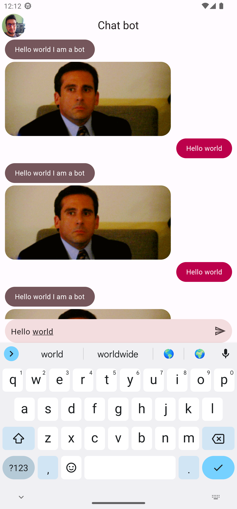

# Yes/No Chat applicacion

This application displays a chat bot that is able to answer your questions with YES or NO.

## Android platform overview

- Minimum supported version: Android version 5.0 Lollipop (Api level 21)
- Application Identifier (applicationId) **com.example.yesnochat_app**

## Get Started 🚀

- Depending on the platform (Windows / MacOS) install Flutter in the stable version `3.7.12`
- In case of using different versions of Flutter, it is recommended to install and use the Flutter [FVM version manager](https://fvm.app/).

```
git clone https://github.com/baguilar6174/flutter-yesNoChat-app.git
```

- Run `flutter pub get` in project root
- Run `flutter run`

## Packages used

* `provider: ^6.0.5` State management

## What I learned

- Using TextEditingControllers
- Focus Nodes
- ThemeData
- State management
- Mappers
- HTPP requests
- Dio

## Yes/No Chat applicacion

<table>
  <tr>
    <td align="center" valign="center"></td>
  </tr>
</table>

## Autor

- Website - [www.bryan-aguilar.com](https://www.bryan-aguilar.com/)
- Medium - [baguilar6174](https://baguilar6174.medium.com/)
- LinkeIn - [baguilar6174](https://www.linkedin.com/in/baguilar6174)
- Email - [bryan.aguilar6174@gmail.com](mailto:bryan.aguilar6174@gmail.com)